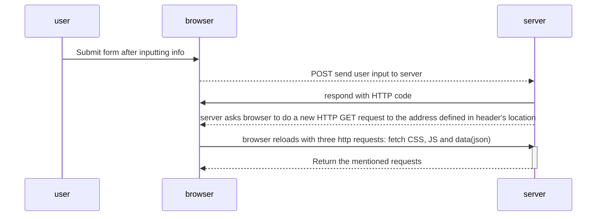

```mermaid
sequenceDiagram
    participant user
    participant browser
    participant server


    user->>browser: Submit form after inputting info

    browser-->>server: POST send user input to server

    server->>browser: respond with HTTP code

    server-->>browser: server asks browser to do a new HTTP GET request to the address defined in header's location


    browser->>server: browser reloads with three http requests: fetch CSS, JS and data(json)
    activate server
    server-->>browser: Return the mentioned requests
    deactivate server

```
