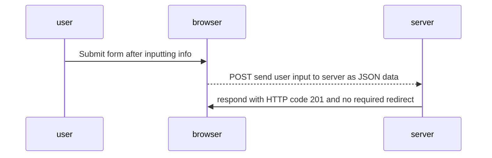

```mermaid
sequenceDiagram
    participant user
    participant browser
    participant server


    user->>browser: Submit form after inputting info

    browser-->>server: POST send user input to server as JSON data

    server->>browser: respond with HTTP code 201 and no required redirect

   
```
